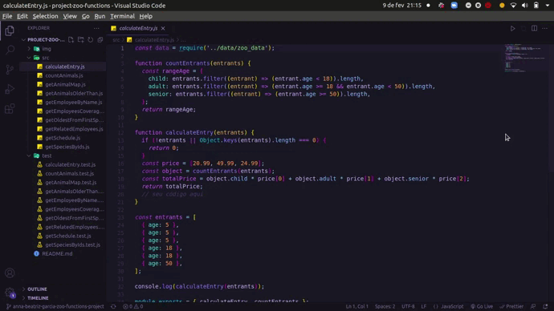

Este projeto contém os requisitos realizados por _[Anna Beatriz Garcia Trajano de Sá](www.linkedin.com/in/anna-beatriz-trajano-de-sá)_ enquanto estudava na [Trybe](https://www.betrybe.com/) :rocket:

# Project Zoo Functions

Implementei várias funções para atender aos requisitos propostos e garantir que todas as funções passem nos testes unitários.

Veja o exemplo a seguir do layout do projeto!

## Demo

## Habilidades Desenvolvidas

Neste projeto, desenvolvi as seguintes habilidades:

 - Produzir código legível, conciso e expressivo utilizando as novas funcionalidades do ES6;
 - Utilizar as Higher Order Functions para manipular e criar arrays;
 - Escolher a Higher Order Function mais adequada para a obtenção de um resultado esperado;
 - Aprender a usar de forma conjunta as Higher Order Functions;
 - Interpretar testes unitários e produzir soluções que atendam a eles.

## Escopo do Projeto

- [Requisitos do projeto](#requisitos-do-projeto)
  - [1. Implemente a função `getSpeciesByIds`](#1-implemente-a-função-getspeciesbyids)
  - [2. Implemente a função `getAnimalsOlderThan`](#2-implemente-a-função-getanimalsolderthan)
  - [3. Implemente a função `getEmployeeByName`](#3-implemente-a-função-getemployeebyname)
  - [4. Implemente a função `getRelatedEmployees`](#4-implemente-a-função-getrelatedemployees)
  - [5. Implemente a função `countAnimals`](#5-implemente-a-função-countanimals)
  - [6. Implemente a função `calculateEntry`](#6-implemente-a-função-calculateentry)
  - [9. Implemente a função `getOldestFromFirstSpecies`](#9-implemente-a-função-getoldestfromfirstspecies)
  - [10. Implemente a função `getEmployeesCoverage`](#10-implemente-a-função-getemployeescoverage)
